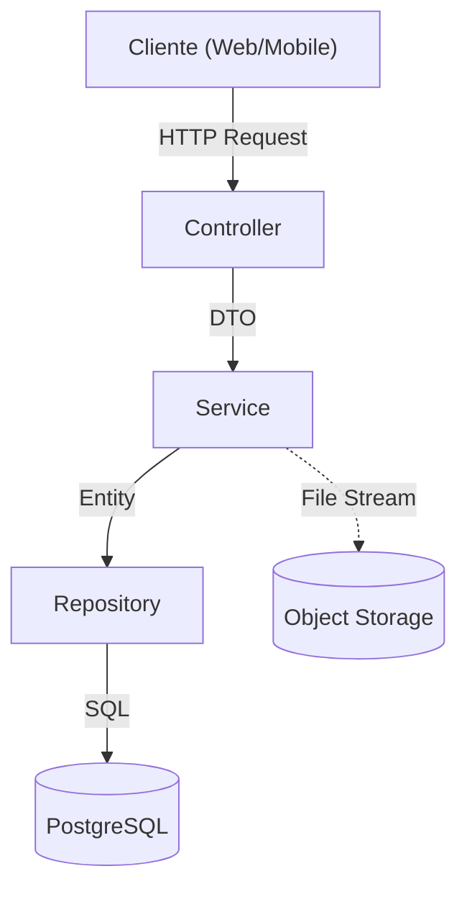

# Music Manager API

API REST em Java (Spring Boot) para gerenciamento de artistas e álbuns. Relacionamento N:N entre artistas e álbuns, autenticação JWT, upload de capas em MinIO, integração com API externa de regionais e WebSocket para notificação de novos álbuns.

---

## Dados do Candidato

| Campo | Valor |
|-------|-------|
| **Nome** | Wendrew Nick Costa Tatehira |
| **Inscrição** | 16323 |
| **Processo Seletivo** | PROCESSO SELETIVO CONJUNTO Nº 001/2026/SEPLAG |
| **Perfil/Vaga** | Engenheiro da Computação - Sênior |

---

## Como rodar

**Pré-requisito:** Docker e Docker Compose instalados.

```bash
docker-compose up --build
```

A API sobe na porta 8080. PostgreSQL e MinIO sobem como dependências. O bucket MinIO é criado automaticamente pelo job `createbuckets` ou pela própria aplicação na inicialização (se ainda não existir).

**Nenhum passo manual.** Não use `localhost` dentro dos containers; os serviços se comunicam pelos nomes `postgres` e `minio`.

---

## Variáveis de ambiente (Docker)

| Serviço | Variável | Descrição | Exemplo |
|---------|----------|-----------|---------|
| **app** | `SPRING_DATASOURCE_URL` | JDBC URL do PostgreSQL | `jdbc:postgresql://postgres:5432/musicdb` |
| **app** | `SPRING_DATASOURCE_USERNAME` | Usuário do banco | `postgres` |
| **app** | `SPRING_DATASOURCE_PASSWORD` | Senha do banco | `postgres` |
| **app** | `MINIO_URL` | Endpoint interno do MinIO | `http://minio:9000` |
| **app** | `MINIO_PUBLIC_URL` | Endpoint externo do MinIO | `http://localhost:9000` |
| **app** | `MINIO_ACCESS_KEY` | Access key do MinIO | `minioadmin` |
| **app** | `MINIO_SECRET_KEY` | Secret key do MinIO | `minioadmin` |
| **postgres** | `POSTGRES_DB` | Nome do banco de dados | `musicdb` |
| **postgres** | `POSTGRES_USER` | Usuário do PostgreSQL | `postgres` |
| **postgres** | `POSTGRES_PASSWORD` | Senha do PostgreSQL | `postgres` |
| **minio** | `MINIO_ROOT_USER` | Usuário admin do MinIO | `minioadmin` |
| **minio** | `MINIO_ROOT_PASSWORD` | Senha admin do MinIO | `minioadmin` |

O nome do bucket (`minio.bucket-name`) vem do `application.yml` (`music-covers`). Outras configs (JWT, actuator, etc.) também podem ser sobrescritas via env.

---

## Como testar

**Via Docker (recomendado)** - não requer Java instalado:

```bash
docker run --rm -v "$(pwd)":/app -w /app maven:3.9-eclipse-temurin-21 mvn test
```

Para testar a API manualmente via Swagger, consulte o [Guia de Testes](./GUIA_DE_TESTES.md) com instruções passo a passo de todos os endpoints.

**Windows PowerShell:**

```powershell
docker run --rm -v "${PWD}:/app" -w /app maven:3.9-eclipse-temurin-21 mvn test
```

**Com Maven local** (requer Java 21):

```bash
./mvnw test
```

Testes unitários cobrem a camada de serviço (Artist, Album, regras de negócio). Nenhum teste de integração ou E2E.

---

## Autenticação

1. **Login:** `POST /api/v1/auth/login` com `{"username":"admin","password":"admin"}`. Retorna `access_token` (5 min) e `refresh_token` (24 h).
2. **Uso:** Enviar `Authorization: Bearer <access_token>` nas requisições protegidas.
3. **Refresh:** `POST /api/v1/auth/refresh` com `Authorization: Bearer <refresh_token>`. Retorna novo `access_token`; o `refresh_token` segue o mesmo.

Endpoints públicos: `/`, `/api/v1/auth/**`, `/actuator/**`, `/swagger-ui/**`, `/api-docs/**`. O resto exige JWT.

---

## Arquitetura e Design

O projeto segue uma **Arquitetura em Camadas (Layered Architecture)** para separar responsabilidades.



### Estrutura de Pastas (ASCII)

```text
src/main/java/com/wendrewnick/musicmanager
├── config/             # Configurações (Swagger, Security, CORS, MinIO, WebSocket, RateLimit)
├── controller/         # Camada de Exposição (REST Endpoints)
├── dto/                # Objetos de Transferência de Dados (Inputs/Outputs)
├── entity/             # Entidades JPA (Mapeamento ORM)
├── exception/          # Tratamento Global de Erros (GlobalExceptionHandler)
├── repository/         # Camada de Acesso a Dados (Interfaces JPA)
├── security/           # JWT, Rate Limit, SecurityConfig
└── service/            # Regras de Negócio e Interfaces
    └── impl/           # Implementação dos Serviços
```

- **Camadas:** Controller → Service → Repository. Regras de negócio só nos serviços.
- **API versionada:** `/api/v1` em todos os endpoints.
- **Banco:** Flyway para migrações. Schema + seed em `db/migration/`.
- **Imagens:** Apenas no MinIO (chaves em `album_images`). Nada em filesystem ou como BLOB no banco. URLs pré-assinadas com 30 min de expiração.
- **Regionais:** Tabela `regionais` sincronizada com API externa (`integrador-argus-api.geia.vip`). Sincronização em background (não bloqueia startup) e a cada 1 minuto. Novos → INSERT; ausentes na API → `ativo = false`; alterados → inativa o antigo e insere o novo.
- **WebSocket:** STOMP em `/ws`, tópico `/topic/albums`. Notificação quando um novo álbum é criado.
- **Rate limit:** 10 req/min por usuário autenticado (ou por IP quando não autenticado). Resposta 429 em JSON com headers informativos (X-RateLimit-*). Limpeza automática de buckets expirados para evitar memory leak.
- **CORS:** Origem permitida apenas `localhost:8080` e `localhost:3000`. Nunca `*`.
- **Health:** Liveness e readiness em `/actuator/health/liveness` e `/actuator/health/readiness`.

---

## Swagger / OpenAPI

Após subir a API:

- **Swagger UI:** [http://localhost:8080/swagger-ui.html](http://localhost:8080/swagger-ui.html)
- **OpenAPI JSON:** [http://localhost:8080/api-docs](http://localhost:8080/api-docs)
- **MinIO Console:** [http://localhost:9001](http://localhost:9001) (login: `minioadmin` / `minioadmin`)

Todos os endpoints estão documentados. Upload de capas (criação de álbum com `multipart/form-data` e `POST /api/v1/albums/{id}/covers`) é testável via Swagger. Use **Authorize** com o access token obtido no login.

---

---

## WebSocket (Notificações em Tempo Real)

A API notifica clientes conectados sempre que um **novo álbum é cadastrado** (`POST /api/v1/albums`).

### Detalhes de Conexão
- **Endpoint:** `http://localhost:8080/ws`
- **Protocolo:** SockJS + STOMP
- **Tópico de Assinatura:** `/topic/albums`
- **Origens Permitidas (CORS):** `http://localhost:8080`, `http://localhost:3000`

### Como Testar
Para validar o recebimento de notificações sem criar um frontend completo, utilize o arquivo `websocket-test.html` incluído na raiz do projeto.

1.  **Inicie o servidor de teste (para contornar CORS):**
    A API bloqueia origens desconhecidas. Sirva o arquivo HTML na porta 3000:
    ```bash
    npx serve -l 3000
    # Ou use Python: python -m http.server 3000
    ```

2.  **Acesse o cliente:**
    Abra [http://localhost:3000/websocket-test.html](http://localhost:3000/websocket-test.html) no navegador.
    - O status deve mudar para **Connected**.

3.  **Dispare um evento:**
    Crie um novo álbum via Swagger ou Curl.
    - Assim que o álbum for criado (HTTP 201), o navegador exibirá logs do JSON recebido em tempo real.

---


Rate limit de 10 requisições por minuto por usuário autenticado (ou por IP quando não autenticado). Implementado com Bucket4j usando algoritmo token bucket.

**Comportamento:**
- Limite aplicado após autenticação (identifica usuário) ou por IP quando não autenticado
- Resposta 429 (Too Many Requests) em JSON quando excedido
- Headers informativos: `X-RateLimit-Limit`, `X-RateLimit-Remaining`, `X-RateLimit-Reset`, `Retry-After`
- Endpoints públicos (Swagger, Actuator health) não são limitados
- Estratégia fail-open: em caso de erro no rate limit, permite a requisição prosseguir

**Configuração:**
```yaml
rate-limit:
  enabled: true
  requests-per-minute: 10
```

**Limpeza automática:** Buckets inativos por mais de 10 minutos são removidos automaticamente para evitar memory leak.

---

## Decisões e trade-offs

- **JWT único para access e refresh:** Mesma estrutura, expirações diferentes. Não há claim `type` para distinguir; em produção faria sentido segregar ou usar refresh tokens opacos.
- **Regionais em background:** Sync não bloqueia o startup. Falha na API externa é apenas logada; a aplicação continua rodando.
- **Bucket MinIO:** Criado pelo job Docker ou na primeira inicialização da app. Em falha de conexão com MinIO, a app sobe mas uploads falham até o MinIO estar disponível.
- **Ordenação de artistas:** Default `sort=name,asc`. Suporta `sort=name,desc` explicitamente.
- **Álbuns por solo/banda:** Filtro `soloOrBand=true` (bandas) ou `soloOrBand=false` (solo). Exige atributo `is_band` em `artists`.
- **Rate limit com fail-open:** Em caso de erro no rate limit, a requisição é permitida (fail-open). Previne que bugs no rate limit bloqueiem a aplicação. Limpeza automática de buckets expirados (10 min de inatividade) previne memory leak em cenários de alto tráfego.
- **Tratamento de exceções:** Todas as exceções retornam ProblemDetail (RFC 7807) com status HTTP apropriado. Nenhum erro 500 não tratado; falhas de MinIO, API externa, banco de dados e validações são capturadas e retornadas de forma estruturada.

---

## Limitações

- **Usuário único:** Apenas `admin`/`admin` (seed). Sem cadastro de usuários, roles ou ABAC.
- **Sem soft delete:** Exclusão de artistas/álbuns é física.
- **Sem paginação configurável** documentada além do padrão do Spring (page, size, sort).
- **WebSocket e CORS:** Origens permitidas fixas (`localhost:8080`, `localhost:3000`). Em produção seria necessário configurar os domínios reais.

---

## O que *não* foi implementado (e por quê)

- **Quarkus:** Escolhido Spring Boot para alinhar ao ecossistema já usado (Actuator, Spring Security, Spring Data, etc.).
- **i18n formal:** Mensagens em PT-BR fixas. Não há suporte a múltiplos idiomas via properties.
- **Testes de integração / E2E:** Apenas testes unitários na camada de serviço. Cobrir controllers e fluxos completos aumentaria o escopo; o foco foi em regras de negócio.
- **Refresh token com revogação:** Tokens não são persistidos nem invalidados. Logout é apenas client-side.

---

## Referências rápidas

- **CRUD:** `GET/POST/PUT/DELETE` em `/api/v1/artists` e `/api/v1/albums`.
- **Paginação de álbuns:** `?page=0&size=10`. Filtros: `title`, `artistName`, `soloOrBand`.
- **Artistas:** `?sort=name,asc` ou `?sort=name,desc`, filtro `name`.
- **Capas:** `POST /api/v1/albums` (multipart: `data` + `images`) ou `POST /api/v1/albums/{id}/covers` (`files`). URLs pré-assinadas: `GET /api/v1/albums/{id}/covers`.

---

<p align="center">
  <i>Desenvolvido por Wendrew Nick Costa Tatehira</i>
</p>
