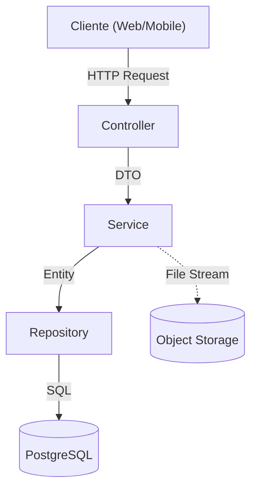

# Music Manager API

> **API REST Profissional para Gerenciamento de Artistas e Álbuns**
> 
> *Desenvolvido com foco em Arquitetura Corporativa, Clean Code e Segurança.*

---

## Visão Geral

Este projeto é uma **API RESTful** desenvolvida em **Java + Spring Boot** para resolver o desafio de gerenciamento de catálogo musical. 
Ele implementa padrões de mercado para garantir escalabilidade, segurança e manutenibilidade, servindo como uma base sólida para sistemas corporativos.

**Principais Funcionalidades:**
-  **CRUD Completo** de Artistas e Álbuns.
-  **Autenticação JWT** (Access + Refresh Token) com Spring Security.
-  **Rate Limiting** para proteção contra ataques de força bruta.
-  **Upload de Imagens** integrado com MinIO (Compatível com AWS S3).
-  **Dockerizado** para execução agnóstica de ambiente.
-  **Documentação Viva** com Swagger/OpenAPI.
-  **Internacionalização (i18n)** completa em Português (PT-BR).

---

##  Arquitetura e Design

O projeto segue uma **Arquitetura em Camadas (Layered Architecture)** rigorosa para separar responsabilidades.



### Estrutura de Pastas (ASCII)
```text
src/main/java/com/wendrewnick/musicmanager
├── config/             # Configurações (Swagger, Security, RateLimit)
├── controller/         # Camada de Exposição (REST Endpoints)
├── dto/                # Objetos de Transferência de Dados (Inputs/Outputs)
├── entity/             # Entidades JPA (Mapeamento ORM)
├── exception/          # Tratamento Global de Erros (GlobalExceptionHandler)
├── repository/         # Camada de Acesso a Dados (Interfaces JPA)
└── service/            # Regras de Negócio e Interfaces
    └── impl/           # Implementação dos Serviços
```

---

## Stack Tecnológica

| Tecnologia | Versão | Função Principal |
| :--- | :--- | :--- |
| **Java** | 21 | Linguagem de programação (LTS). |
| **Spring Boot** | 3.2.2 | Framework para desenvolvimento ágil. |
| **PostgreSQL** | 15+ | Banco de dados relacional robusto. |
| **Flyway** | 9.x | Versionamento (Migrations) do Banco de Dados. |
| **MinIO** | 8.5.7 | Object Storage para upload de imagens. |
| **Docker** | Latest | Orquestração de containers e ambiente. |
| **Spring Security** | 6.x | Segurança, Autenticação e Autorização. |
| **JWT (JJWT)** | 0.12.3 | JSON Web Token para sessões stateless. |
| **Bucket4j** | 8.7.0 | Implementação de Rate Limiting. |
| **Lombok** | 1.18.x | Redução de código boilerplate. |

---

## Como Executar (Guia Passo-a-Passo)

Pré-requisito único: **Docker** instalado e rodando. Nada mais.

Escolha seu sistema operacional e o método de instalação preferido.

### Windows

#### Opção A: Instalação Automática (Recomendada)
O inicializador configura tudo para você.
1. Abra a pasta do projeto.
2. Execute o arquivo: **`Iniciar-MusicManager.bat`**
3. Aguarde a mensagem de sucesso e o navegador abrirá automaticamente.

#### Opção B: Instalação Manual
```powershell
docker compose up -d --build
```

### Linux

#### Opção A: Instalação Automática (Recomendada)
1. Dê permissão de execução e rode o script:
   ```bash
   chmod +x Iniciar-MusicManager.sh
   ./Iniciar-MusicManager.sh
   ```

#### Opção B: Instalação Manual
```bash
docker compose up -d --build
```

### Como Rodar os Testes
Para verificar a integridade da aplicação e executar a suíte de testes unitários:
```bash
mvn test
```

---

##  Documentação da API

Após iniciar, acesse a documentação interativa completa (Swagger UI). Nela você pode testar todos os endpoints diretamente pelo navegador.

-> **URL:** [http://localhost:8080/swagger-ui.html](http://localhost:8080/swagger-ui.html)

### Credenciais de Acesso (Seed)
O sistema cria automaticamente um usuário administrador na primeira execução:

- **Usuário:** `admin`
- **Senha:** `admin`

> **Nota:** Para acessar os endpoints protegidos no Swagger, faça login no endpoint `/auth`, copie o **Access Token**, clique no botão **Authorize** (cadeado) e cole o token.

---

## Decisões Técnicas

1.  **JWT com Refresh Token:** Eu decidi implementar um fluxo completo de renovação de token para garantir segurança (tokens de acesso curtos) sem prejudicar a experiência do usuário (login persistente seguro).
2.  **MinIO para Uploads:** Em vez de salvar imagens no disco do servidor (o que quebraria em ambientes de nuvem efêmeros), eu utilizei um Object Storage compatível com S3. Isso torna a migração para AWS S3 transparente.
3.  **Rate Limiting:** Eu implementei um filtro de Servlet (Bucket4j) para proteger a API de abusos, garantindo disponibilidade mesmo sob carga.
4.  **Installer Scripts:** Eu criei scripts de inicialização (`.bat`/`.sh`) para abstrair a complexidade do Docker Compose para avaliadores ou usuários menos técnicos.
5.  **Padronização de API:** Respostas de sucesso seguem um envelope padrão (`ApiResponse`), enquanto erros utilizam o padrão RFC 7807 (`ProblemDetail`) para máxima interoperabilidade.
6.  **Auditoria Automática:** Todas as entidades possuem rastreamento automático de criação e modificação (`createdAt`, `updatedAt`) via JPA Auditing.
7.  **Testes Unitários:** A camada de serviço foi coberta com testes unitários usando **JUnit 5** e **Mockito** para garantir a integridade das regras de negócio.

---

<p align="center">
  <i>Desenvolvido por Wendrew Nick Costa Tatehira</i>
</p>
